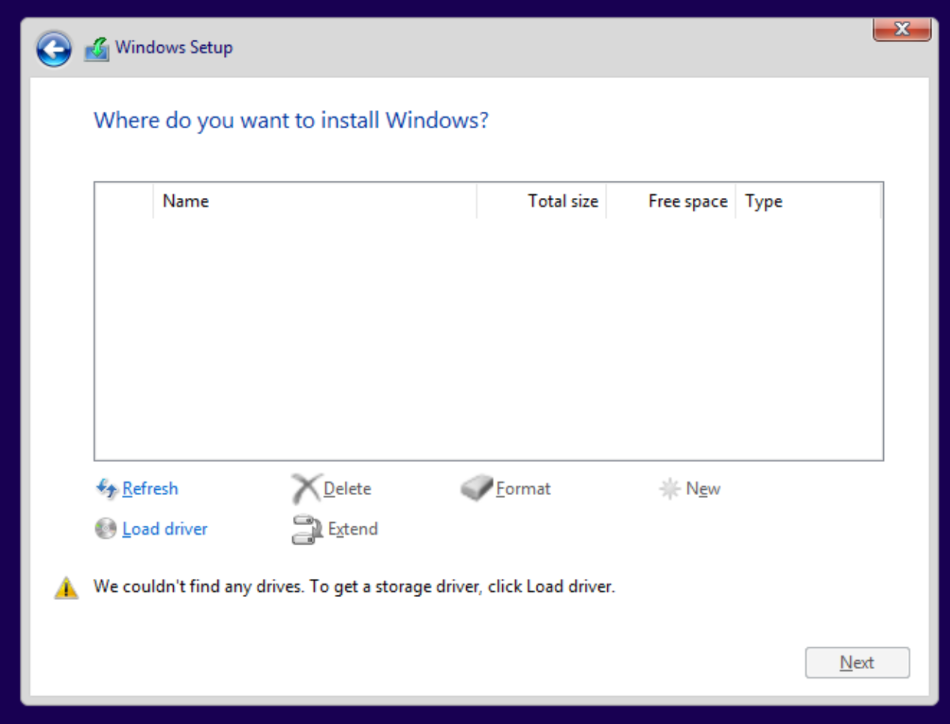
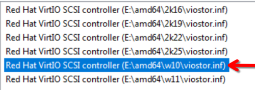

# Creating a Windows 10 VM
If you already have a Windows VM, please check the [Setting up for passthrough](#setting-up-for-passthrough) section.

You'll need the following things:
1. A Windows installation ISO (get one from [here](https://www.microsoft.com/en-us/software-download/windows11)).
2. VirtIO drivers ISO (get it from [here](https://fedorapeople.org/groups/virt/virtio-win/direct-downloads/latest-virtio/virtio-win.iso)) - more info [here](https://github.com/virtio-win/virtio-win-pkg-scripts/blob/master/README.md).
---
1. Open up *Virtual Machine Manager*, and authenticate with your user account if asked.
2. Click on `File`>`New Virtual Machine`.
3. Choose `Local install media` and click `Forward`.
4. Under `Choose ISO or CDROM install media` Click `Browse`.
5. Click `Browse Local`.
6. Select your Windows ISO.
7. If asked to fix permissions, choose *yes*. 
8. One the file picker closes, make sure you have `Microsoft Windows 10`/`11` autoselected under `Choose the operating system you are installing`. **If not, make sure you have selected the correct ISO.** If you're sure, uncheck `Automatically detect from the installation media / source` and select the option manually.
9. Click `Forward`.
10. You can now select how much RAM and CPU resources you want to allocate for the VM. **Please ignore this part of the setup, as it will not set the CPU topology correctly. We'll change them later.** You can leave these values alone, just click `Forward`.
11. Select the size of the virtual drive according to your needs, and click `Forward`.
12. Check `Customize configuration before install` and click `Finish`.
13. Go to the `CPU` settings, and make sure `Copy host CPU configuration (host-passthrough)` is checked.
14. Expand the `Topology` section, and check `Manually set CPU topology`.
15. Set `Sockets` to 1. *(Your computer only has 1 CPU. This is for large servers that may have more.)*
16. Set `Cores` and `Threads` to whatever you need. The total vCPUs allocated to your VM will be `Cores * Threads`. You can also see this next to  `Total vCPU allocation`.
17. Click `Apply`.
18. Go to `Memory` and set it up according to your needs. Click `Apply` afterwards.
19. Go to `SATA Disk 1` and change the device bus from `SATA` to `VirtIO` This is a much faster virtual bus. Click `Apply` afterwards.
20. Open the network controller settings (named `NIC :XX:XX:XX` - this is random). Change `Device model` to `virtio`. Click `Apply` afterwards.
21. *(Optional) Enable basic 3D acceleration (temporarily - until we set up GPU passthrough, this will make the installation experience slightly smoother).*
	1. Go to `Display Splice` and check `OpenGL`. Select `Auto` from the list of GPUs. **Do not select your dGPU!**
	2. Set `Listen type` to `None`.
	3. Click `Apply`.
	4. Go to `Video QXL` and change the model to `Virtio`. Check `3D acceleration`. Make sure it's a ☑️ and not `...`. Click `Apply`.
22. Right click on `Channel 1 (spice)` and click `Remove Hardware`.
23. Click on `Add Hardware` and select `Channel`.
24. Set `Device type` to `QEMU vdagent (qemu-vdagent)` and click on `Finish`.
25. Click on `Add Hardware` and select `Storage`.
26. Select `Select or create custom storage`. Then click on `Manage`.
27. Click `Browse Local` and choose the VirtIO drivers ISO.
28. Change `Device type` to `CDROM device` and set `Bus type` to `SATA`.
29. Click `Finish`.
30. Go to `Boot Options` and make sure you have the following boot order:
	1. `VirtIO Disk 1` - Your virtual hard drive.
	2. `SATA CDROM 1` - The Windows installation ISO.
	3. `Sata CDROM 2` - The VirtIO drivers ISO.
31. Click `Apply` if you had to change something.
32. Click on `Begin Installation`.

Your VM will now start booting into the Windows installer. To scale up the display go to `View`>`Scale Display` and choose `Always`. You can now follow the installer's instructions until you get to `Where do you want to install Windows?`.

You'll see that there are no drives on this list. This is because Windows does not have VirtIO drivers by default.
.

Click on `Load driver` and click `OK`. **Don't click `Browse`, Windows will find the drivers automatically.**

> Since I'm working with Windows 10, I'll select the `w10` version. Click `Next` after selecting your driver.

You should now see your virtual drive show up. Continue with the installation as you normally would.
#### Installing the VirtIO drivers on Windows
After you have successfully installed Windows and you're on the desktop, open up File Explorer and open the CD drive with the VirtIO drivers. On the bottom of the file list, you should see a `virtio-win-guest-tools` executable. Run it and follow the installer's instructions. **Please do not run the `virtio-win-gt-x64`/`x86` MSI installers.**

Once that's done, reboot the VM.
#### Cleaning up
After you shut down the VM, you can remove the SATA drives.
#### Setting up for passthrough
1. You should turn off the basic 3D acceleration we set up before.
	1. Go to `Video` settings and change `Model` to `QXL`.
	2. Go to `Display Spice` and change `Listen type` to `Address` and uncheck `OpenGL`.

#### Done, continue with the [next part](KERNEL_SETUP.md)!